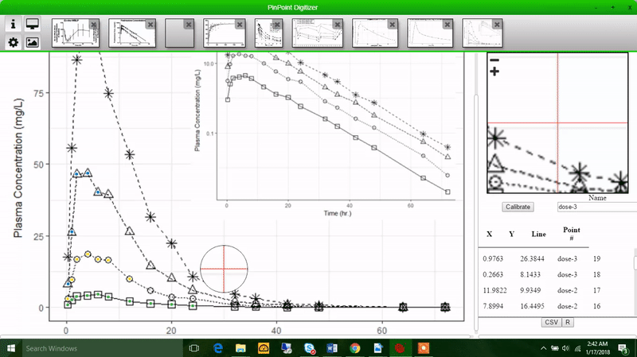

## PinPoint Digitzer

  

PinPoint Digitizer is an open-source, cross-platform, desktop application to facilitate the extraction of data from images of plots. Data can be captured from plots with both linear or log scaled axes. PinPoint's user interface was designed for maximal accuracy and an intuitive workflow. 

## User Manual
https://mhismail.gitbooks.io/pinpoint-digitizer-user-manual/

## Features 

 - Magnifying glass effect with cross hairs for pixel perfect accuracy
 - Load in multiple plots at once or drag and drop images into interface
 - Download data as a csv file or copy to clipboard in various formats (R data.frame, python Array, comma-seperated)
 - Keyboard shortcuts for zooming and adjusting/deleting points
 - Label groups of points as they are captured to easily organize data (i.e. multiple lines on same plot)
 - Capture data from facetted/multiple plots in same image 
 - Handles skewed/distorted axes
 

## Installation 

### Windows
https://github.com/mhismail/PinPoint/releases/download/pinpointv0.1.0/PinPoint.Setup.0.1.0.exe

Download and run installer

### Linux
https://github.com/mhismail/PinPoint/releases/download/pinpointv0.1.0/PinPoint_0.1.0_amd64.2.deb

Download installer, navigate to downloads in terminal and run:
`sudo dpkg -i PinPoint_0.1.0_amd64.2.deb`

## Build
To build from source, clone repository and run:
`npm install`

and to start:
`npm start`

## Demo 

### Load in multiple images

### Calibrate axes

### Capture points

### Screen capture

### Change preferences 

### Export data

*Plots shown do not belong to me and are used only for demonstration purposes

<a href = "https://github.com/mhismail/PinPoint#installation"> How to Install </a>

## Credits
Logo made with Logomakr.com
